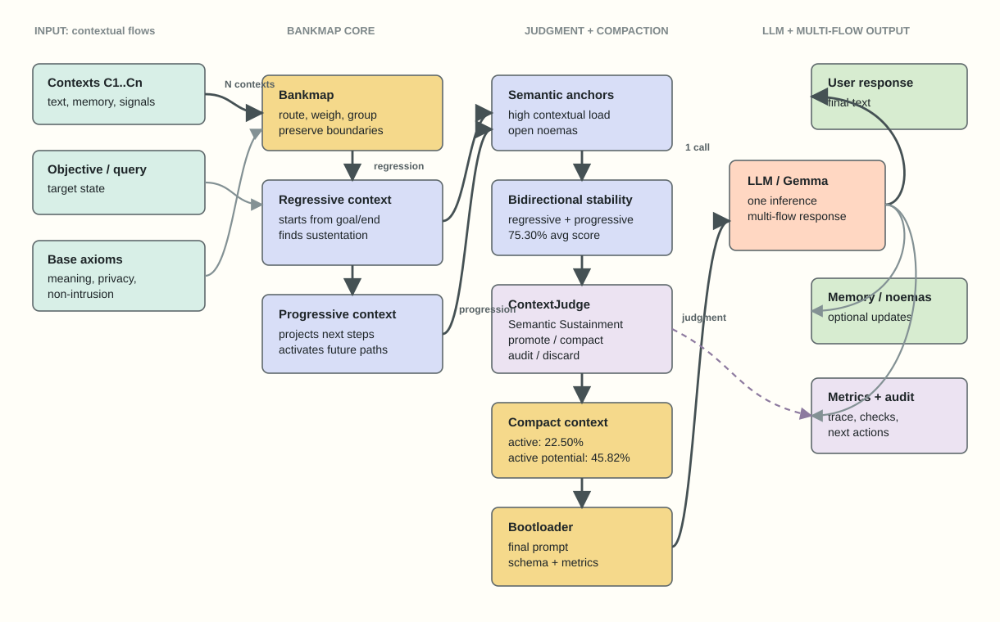

# NoemaKernel

Experimental runtime for auditable semantic context routing before LLM inference.



NoemaKernel is an experimental architecture for contextual navigation in LLM
workflows.

It is not a model, not an agent framework, and not a benchmark. It is a small
runtime layer that tries to decide which context should reach an LLM, which
context should be compacted, which context should be audited, and which context
should be discarded.

Core idea:

```text
LLMs do not only need more context.
They need better contextual routing before inference.
```

## What It Does

NoemaKernel currently implements:

- `Bankmap`: contextual navigation and anchor selection.
- Regressive context: evaluates what previous/final context sustains the goal.
- Progressive context: evaluates what a context activates next.
- Bidirectional context: crosses regressive and progressive signals.
- `ContextJudge`: scores each context with a Semantic Sustainment Score.
- Multi-flow output preparation: response, memory, noemas, audit trail, checks
  and metrics.
- Optional Gemma/Gemini and OpenAI API clients.
- Interactive Gemma terminal for runtime testing.

The system takes many context blocks and tries to produce a smaller, auditable
context package for one LLM call.

## Minimal Example

```python
from noemakernel import BankmapEngine, ContextItem
from noemakernel.context_judge import ContextJudge
contexts = [ContextItem("c1", "Bankmap preserves semantic anchors.")]
objective = "Route useful context before inference."
packet = BankmapEngine().build_packet(contexts, objective)
judge = ContextJudge(profile="llm_continuous")
result = judge.judge_context(contexts[0], objective, {"future_contexts": []})
print(packet.compact_context)
print(result.to_dict()["decision"])
```

## Why It Exists

Long context alone does not solve contextual quality. A model can receive more
tokens and still lose the operational structure of the task.

NoemaKernel explores a different layer:

```text
Before the model receives context, judge the context.
Before compressing text, preserve contextual function.
Before calling an LLM, make the context path auditable.
```

## Architecture

```text
Context blocks
  -> Bankmap
  -> Regressive / progressive evaluation
  -> Semantic anchors
  -> Bidirectional stability
  -> ContextJudge
  -> promote / compact / audit / discard
  -> compact context packet
  -> LLM / Gemma / OpenAI
  -> multi-flow output
```

Visual files:

- `checagem/grafo-arquitetura.svg`
- `checagem/grafo-arquitetura-mermaid.md`
- `checagem/grafo-arquitetura.html`
- `checagem/context-judge-test-flow.svg`

## ContextJudge

`ContextJudge` evaluates each context block against a query and system state.

It returns:

- `judge_score`
- `decision`: `promote`, `compact`, `audit`, or `discard`
- `color_state`
- raw metric terms
- weighted terms
- audit reason
- repair instruction

The score is called:

```text
Semantic Sustainment Score
```

Current `llm_continuous` calibration on the local 40-context stress set:

```text
semantic_sustainment_score_avg: 50.83%
semantic_power_avg: 43.88%
progressive_potentialization_avg: 24.40%
active contexts (promote/compact): 22.50%
audit queue: 42.50%
discarded contexts: 35.00%
active progressive potentialization: 45.82%
```

These are heuristic development metrics, not benchmark results.

## Claims

### Research Claim

Context quality can be evaluated before inference by combining semantic anchors,
regressive/progressive relationships and auditable context decisions.

This is a research direction. It still needs external judges, stronger semantic
evaluation and human-labeled comparisons.

### Engineering Claim

NoemaKernel provides a working Python prototype that:

- accepts multiple context blocks;
- extracts and scores anchors;
- evaluates bidirectional context signals;
- judges context with `promote`, `compact`, `audit` and `discard`;
- emits JSON-serializable audit data;
- runs with standard-library Python.

### What It Does Not Claim

NoemaKernel does not claim:

- benchmark-level quality;
- guaranteed compression;
- replacement for agents;
- replacement for retrieval systems;
- model-level memory optimization;
- validated cognitive metrics;
- production readiness.

## Relation To TurboQuant

Google Research describes TurboQuant as a vector quantization approach for
reducing high-dimensional vector and KV-cache memory pressure in LLM and vector
search systems:

https://research.google/blog/turboquant-redefining-ai-efficiency-with-extreme-compression/

NoemaKernel is not TurboQuant and does not implement TurboQuant.

The relationship is complementary:

- TurboQuant targets memory efficiency inside model/vector infrastructure.
- NoemaKernel targets semantic context selection before inference.
- TurboQuant asks: how can more long-context computation fit efficiently?
- NoemaKernel asks: which context deserves to enter the computation at all?

If long-context systems become cheaper and faster, the next bottleneck is still
context quality. NoemaKernel is an experiment in that upstream layer.

## What Is Fragile

This project is intentionally honest about its weak points:

- Metrics are heuristic.
- No embedding model is used yet.
- Context scoring is lexical and rule-based.
- ContextJudge calibration is local and early.
- `audit` is not a real external judge yet.
- API calls can fail or timeout depending on provider/model availability.
- The current stress set is useful for development, not enough for claims.
- The project should not be presented as a benchmark or as proof of quality.

The strongest next step is to add an external LLM-as-judge path and compare
NoemaKernel decisions against human labels or stronger semantic evaluators.

## Install / Setup

This prototype uses the Python standard library only.

```powershell
git clone https://github.com/omega-Core-Dev/NoemaKernel.git
cd NoemaKernel
python -m unittest discover -s tests
```

## Run Local Demo

```powershell
python .\examples\demo_bankmap.py
```

## Run Tests

```powershell
python -m unittest discover -s tests
```

Current local status:

```text
18 tests OK
```

## Run Stress Metrics

```powershell
python .\examples\run_stress_test.py
python .\examples\compare_bankmap_modes.py
python .\examples\run_reactivation_test.py
python .\examples\run_bidirectional_test.py
python .\examples\run_context_judge_test.py
```

Generated outputs go to:

```text
artifacts/stress/
```

## Generate Prompts

```powershell
python .\examples\generate_chatgpt_prompts.py
```

Outputs:

- `artifacts/prompts/baseline_raw_prompt.md`
- `artifacts/prompts/bankmap_compact_prompt.md`
- `artifacts/prompts/bankmap_packet.json`

## Gemma / Gemini API

Use an environment variable:

```powershell
$env:GEMINI_API_KEY="your-key"
$env:GEMMA_MODEL="gemma-4-31b-it"
python .\examples\run_gemma_bankmap.py
```

Or use local files:

```powershell
Copy-Item .env.example .env
notepad .env
```

Or:

```powershell
Copy-Item local_api_key.example.py local_api_key.py
notepad local_api_key.py
```

`local_api_key.py` and `.env` are ignored by Git.

## Interactive Gemma Terminal

```powershell
python .\examples\gemma_terminal.py
```

Useful options:

```powershell
python .\examples\gemma_terminal.py --model gemma-4-31b-it --temperature 0.4 --max-output-tokens 2048
python .\examples\gemma_terminal.py --json
```

Runtime commands:

```text
/help
/model gemma-4-31b-it
/temp 0.3
/tokens 4096
/json on
/json off
/clear
/raw
/exit
```

## OpenAI API

In `local_api_key.py`:

```python
OPENAI_API_KEY = "your-key"
OPENAI_MODEL = "gpt-5.4-mini"
OPENAI_MAX_OUTPUT_TOKENS = 2048
OPENAI_TIMEOUT_SECONDS = 180
```

Then:

```powershell
python .\examples\run_openai_bankmap.py
```

## Security

Do not commit API keys.

Ignored by default:

- `.env`
- `local_api_key.py`
- `artifacts/gemma/*.json`
- `artifacts/gemma/*.md`
- `artifacts/openai/*.json`
- `artifacts/openai/*.md`

## Public Claim

Safe public wording:

```text
NoemaKernel is an experimental open-source architecture for bidirectional
contextual navigation and auditable context judging in LLM workflows.
```

Avoid:

```text
benchmark
agent replacement
guaranteed compression
quality proof
```
