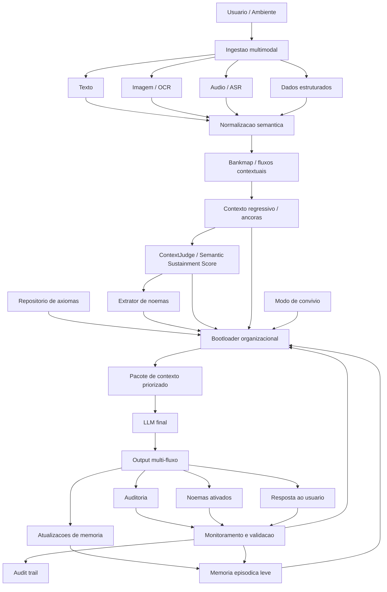
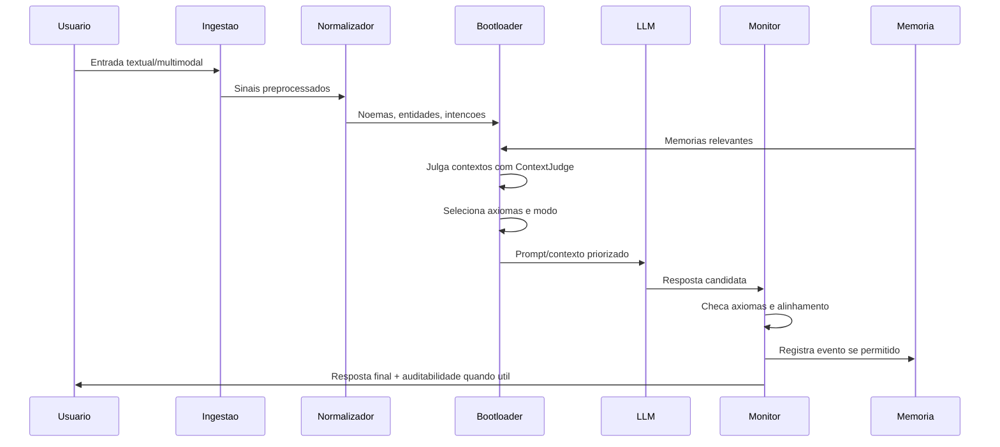
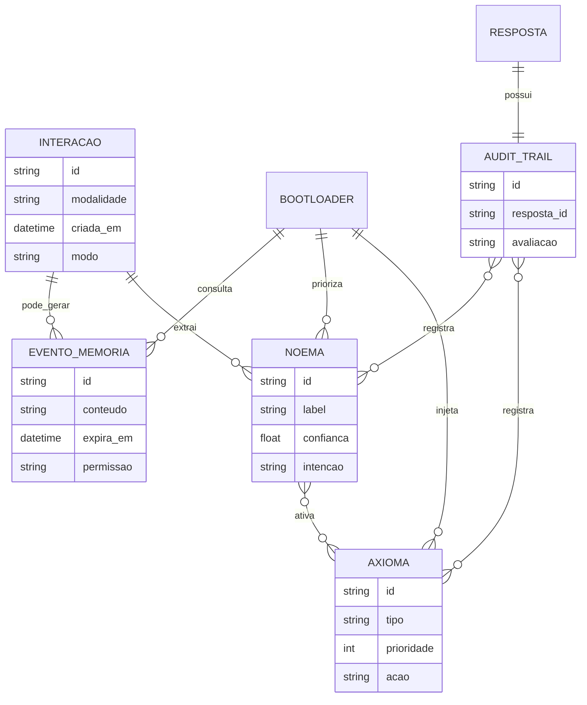
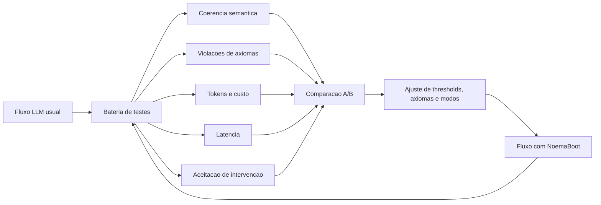

# Diagramas

Os diagramas abaixo usam Mermaid e podem ser renderizados em ferramentas compativeis com Markdown.

## Arquitetura em camadas

## Fluxo de inferencia

## Modelo conceitual de dados

## Loop de avaliacao

