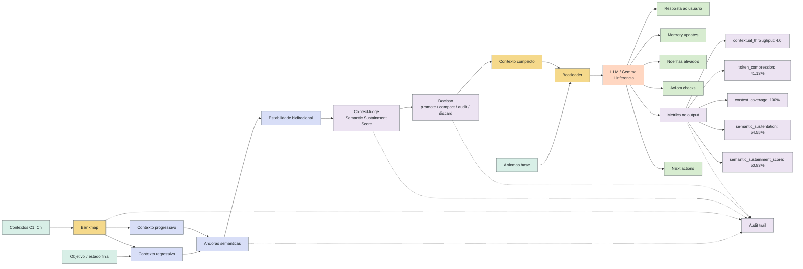

# Grafo da Arquitetura

```mermaid
flowchart LR
    C[Contextos C1..Cn] --> BM[Bankmap]
    O[Objetivo / estado final] --> CR[Contexto regressivo]
    AX[Axiomas base] --> BL[Bootloader]

    BM --> CR
    BM --> CP[Contexto progressivo]
    CR --> AS[Ancoras semanticas]
    CP --> AS
    AS --> EB[Estabilidade bidirecional]
    EB --> CJ[ContextJudge<br/>Semantic Sustainment Score]
    CJ --> JD[Decisao<br/>promote / compact / audit / discard]
    JD --> CC[Contexto compacto]
    CC --> BL
    BL --> LLM[LLM / Gemma<br/>1 inferencia]

    LLM --> RU[Resposta ao usuario]
    LLM --> MEM[Memory updates]
    LLM --> NO[Noemas ativados]
    LLM --> AC[Axiom checks]
    LLM --> MT[Metrics no output]
    LLM --> NX[Next actions]

    AS -.-> AUD[Audit trail]
    BM -.-> AUD
    CJ -.-> AUD
    JD -.-> AUD
    MT -.-> AUD

    MT --> M1[contextual_throughput: 4.0]
    MT --> M2[token_compression: 41.13%]
    MT --> M3[context_coverage: 100%]
    MT --> M4[semantic_sustentation: 54.55%]
    MT --> M5[semantic_sustainment_score: 50.83%]

    classDef input fill:#d8efe7,stroke:#5e686b,color:#1e2528;
    classDef core fill:#f5d98b,stroke:#5e686b,color:#1e2528;
    classDef reason fill:#d8def7,stroke:#5e686b,color:#1e2528;
    classDef llm fill:#ffd7c2,stroke:#5e686b,color:#1e2528;
    classDef output fill:#d7ecd0,stroke:#5e686b,color:#1e2528;
    classDef audit fill:#ece3f2,stroke:#5e686b,color:#1e2528;

    class C,O,AX input;
    class BM,CC,BL core;
    class CR,CP,AS,EB reason;
    class LLM llm;
    class RU,MEM,NO,AC,NX output;
    class CJ,JD,MT,AUD,M1,M2,M3,M4,M5 audit;
```
